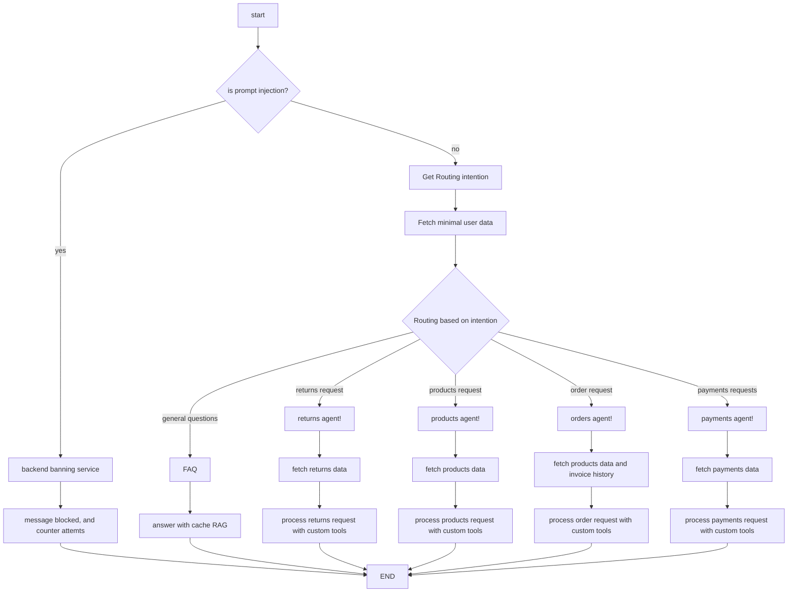

# Part 6 — Architecture Reasoning

---

## 6.1 — Understanding the architecture change

The current graph in `source/application/graph.py` follows a single sequential path: `fetch_user_data → handle_general → END`. The single node `source/domain/handle_general.py` is a monolith — it receives the full knowledge base, all user data, and every possible intent in one LLM call. Introducing a router and specialized agents changes the operational profile significantly across every MLOps dimension.

**Latency**

The current architecture makes one LLM call per turn (~1–3 s). A router + specialized agent introduces a minimum of two serial LLM calls (~2–6 s), and three calls if a quality-check node is added (~3–9 s). The sequential dependency is unavoidable for the router→agent hop: the agent's entire input — which knowledge base section to use, which data fields to include — depends on the router's classification output. There is no way to parallelize this pair without speculative execution (discussed in 6.2).

**Monitoring complexity**

Today, a single metric covers every turn: `handle_general` latency and success rate. With a router and four specialized agents, the metric surface expands significantly:

| New KPI | Why it matters |
|---|---|
| Routing accuracy | The most dangerous new failure mode — a misclassification produces a wrong answer with no exception raised and no alert fired |
| Per-agent latency p95 | Orders and returns are structurally different flows; a single aggregate latency hides regressions |
| Per-agent error rate | A failure in `handle_payments` must not mask a healthy `handle_orders` |
| Routing distribution | Shift in intent distribution is an early signal of product or UX change |

Conversation traces also become more complex: a single conversation may route to `handle_orders`, return to the router on a follow-up, then route to `handle_payments`. Trace correlation across multiple agents requires that every LLM call within a turn carries the same `correlation_id` (already implemented in `CorrelationIdMiddleware`) so the full multi-agent call chain is reconstructable from logs.

**Failure modes**

The most dangerous failure mode in the new architecture is **silent misrouting**. If the router sends a return request to `handle_products`, the user receives a plausible but wrong answer. No exception is raised, latency looks normal, and no alert fires. This failure is invisible unless routing accuracy is measured independently — for example, by logging the predicted intent alongside the user's message and periodically sampling for human evaluation. A fallback path that routes unrecognized or low-confidence intents to `handle_general` (the current behavior) prevents hard failures during router warm-up.

**Testing strategy**

Unit tests for individual nodes remain the foundation. The key addition is **routing-layer testing**: a golden set of labeled intent examples (`"¿dónde está mi pedido?" → handle_orders`, `"quiero devolver un producto" → handle_returns`) used to measure routing accuracy before every deployment. Agents that are not being changed should not be re-tested in depth; the isolation strategy is to freeze all nodes except the one being modified, preventing regressions from unrelated changes.

**State schema and deployment**

`GraphState` in `source/application/state.py` is a `TypedDict` stored in `MemorySaver` checkpoints. Adding fields for new agents creates a schema migration risk: old conversation threads missing new fields will either raise a `KeyError` or silently receive `None`. Every `GraphState` extension must define safe defaults for all new fields. On the deployment side, the existing A/B infrastructure from Part 2 provides the right rollout mechanism: deploy the router but keep `handle_general` as a 100% fallback initially, then progressively cut traffic to individual specialized agents one at a time. All five new artifacts — one router prompt and four agent prompts — must be versioned independently in MLflow or equivalent.

**Knowledge base and context isolation**

`source/adapters/utils/data_filter.py` currently reduces user data to fields relevant to `selected_topic` before it reaches the LLM. In the new architecture, each specialized agent owns its own filter scope: the orders agent has no use for payment history, and injecting it into the context actively degrades response quality by introducing irrelevant tokens. The `data_filter.py` pattern is preserved and extended — each subgraph applies its own filter rather than sharing a generic one.

---

## 6.2 — Latency vs. quality trade-off

With three sequential LLM calls (router + agent + quality-check), end-to-end response time can reach 5–9 s. The following patterns address this at different layers:

**Speculative execution**

Run all agents in parallel from the router's input and discard the results of agents the router did not select. This converts serial latency (`max(router, agent)` instead of `router + agent`), reducing p95 from ~6 s to ~3 s. The trade-off is cost: instead of paying for 2 completions, you pay for 5 (router + 4 agents). Output tokens are not cached, so speculative execution is a deliberate **latency-for-cost swap**, not a free optimization. It is viable at low volume but unsustainable at scale.

**Lightweight router**

Replace the LLM router with a fine-tuned **DistilBERT intent classifier**. A GPU-served classifier completes in ~50–200 ms vs. 1–3 s for an LLM call. For a Colombian e-commerce bot, intents are bounded and well-defined (orders, payments, returns, products, general); a classifier with a few hundred labeled examples per intent is sufficient. This is the highest ROI latency optimization available: it eliminates an entire LLM call from the critical path while adding a lightweight, independently deployable ML model.

**Response streaming**

The current `POST /chat` endpoint waits for the full `generation` string before responding. Enabling streaming via LangChain's `astream()` and FastAPI's `StreamingResponse` drops time-to-first-token (TTFT) from ~3–4 s to ~200–500 ms. This requires two targeted changes: add `streaming=True` to `ChatOpenAI` in `source/adapters/chains/general_chain.py`, and change the endpoint response type. The end-to-end latency is unchanged, but perceived latency drops dramatically.

**Semantic caching**

For a commercial e-commerce bot, a significant fraction of messages are structurally identical across users (`"¿cuándo llega mi pedido?"`, `"¿cómo hago una devolución?"`). Embedding incoming messages and comparing against a vector index of previously answered questions (via Redis + embeddings or `GPTCache`) can achieve 20–40% cache hit rates, eliminating LLM calls entirely for those requests.

**Two-message UX pattern**

As a complementary technique, returning an immediate acknowledgement (`"Estoy procesando tu solicitud, un momento..."`) before the agent response begins creates a more relaxed conversational experience, reducing perceived frustration during longer processing times even when TTFT is not technically improved.

**SLO definition**

The current `CHAT_TIMEOUT_SECONDS = 30` in `deliverables/part1_api_and_containerization/app/config.py` is far too permissive for a conversational UX. The recommended SLO:

| Metric | Target | Alert threshold |
|---|---|---|
| p50 TTFT | < 2 s | — |
| p95 TTFT | < 4 s | Warning at 3.5 s |
| p99 TTFT | < 6 s | Critical at 5 s |
| Hard timeout | 8 s | 504 response |

These thresholds should be enforced by tightening `CHAT_TIMEOUT_SECONDS` to 8 and adding percentile-based latency alerts in the observability layer. The p95 threshold is the contractual SLO — p75 is a diagnostic metric, not a user-facing commitment.

---

## 6.3 — Architecture optimization proposal

### Proposed change: divide-and-conquer with specialized subgraphs

The core change is decomposing `handle_general` (currently a monolith in `source/domain/handle_general.py`) into a router and four independent specialized subgraphs. Each subgraph is a complete LangGraph `StateGraph` — not a single node — because each domain represents a structured, multi-step process. An order flow involves recommendation, transaction validation, confirmation, and invoice generation; a returns flow involves eligibility check, return initiation, and refund tracking. These require independent state, independent tools, and independent data access patterns.

### Entry-point parallelism

The most impactful latency optimization is running **intent classification, prompt injection detection, and user data fetching concurrently** at the start of every turn, before any specialized subgraph executes. This eliminates the sequential dependency between the security check and routing that would otherwise add 500 ms–2 s to every request.

> **Note on parallelism:** In the diagram below, `START` fans out simultaneously to the injection check, the routing node, and `fetch_minimal_user_data`. These three execute concurrently — a gate node synchronizes their results before proceeding. If injection is detected, the graph short-circuits to the banning service regardless of routing result. If injection is clear, the routing decision determines which subgraph executes next. This is analogous to LangGraph's `Send` API for fan-out, with a conditional edge acting as the join gate.

### GraphState inheritance model

Each subgraph defines its own `TypedDict` that extends a shared `BaseState` containing `user_id`, `conversation_id`, and the last N turns of conversation history. The router writes its classification result to the base state. Specialized subgraphs extend it: `OrderState` adds `cart_items`, `payment_method`, `confirmation_token`; `ReturnsState` adds `order_id`, `return_reason`, `refund_status`. States never overlap across subgraphs, eliminating the monolithic `GraphState` fields that accumulate over time.

The `fetch_data` step inside each subgraph is not a full user data fetch — it is a **filter and scope** operation. All user data is fetched once at entry (extending `source/adapters/utils/data_filter.py`'s existing pattern), and each subgraph's fetch step reduces it to only the fields its LLM context needs. This preserves the token optimization that `data_filter.py` already implements while making the scope explicit per agent.

### Modified graph

### Per-agent monitoring

Each subgraph requires its own SLI set. Beyond standard latency and error rate, business-level metrics are essential to demonstrate agent value:

| Agent | Key business metric |
|---|---|
| `handle_orders` | Purchase intent → conversion rate |
| `handle_returns` | Return request resolution rate |
| `handle_payments` | Payment inquiry resolution without escalation |
| `handle_products` | Product recommendation click-through rate |
| Router | Routing accuracy (sampled human evaluation) |

### Security escalation

Prompt injection is handled in three progressive layers:
1. **Rule-based pre-filter** at the API boundary — regex patterns for common injection phrases, near-zero latency
2. **Concurrent LLM injection classifier** — runs in parallel with routing at graph entry
3. **BERT/ELMo text classifier** (maturity-gated) — fine-tuned on domain-specific injection examples as labeled data accumulates

If injection is detected: first occurrence returns a warning. After 2 additional attempts in the same conversation, the session is stopped and the user is flagged for manual review before any potential ban. This escalation prevents false positives from triggering permanent bans.

### Infrastructure notes

- **Conversation state**: `MemorySaver` replaced by Redis (active sessions, 10-turn cap) + DynamoDB (durable persistence), as designed in Part 5. Each subgraph checkpoint is scoped to its own namespace within the conversation key.
- **Throttling**: semaphore-based concurrency limit on outbound LLM calls, combined with a token bucket for RPM enforcement against the OpenAI API (as noted in Part 5, a token bucket controls throughput over time whereas a semaphore only limits concurrency).
- **Async event pipeline**: Kafka or AWS Kinesis for streaming conversation events to analytics, audit logs, and fine-tuning datasets — this is independent of the user-facing response path. The real-time response path uses `StreamingResponse` + `astream()`, not a queue.
- **Knowledge base**: `source/adapters/utils/knowledge_base.py` is replaced by an RDS database queried at runtime, enabling real-time product, pricing, and policy data without redeployment.
- **Scaling**: AWS Fargate with autoscaling behind an Application Load Balancer, as detailed in Part 5.

### Expected improvement

| Metric | Current | After optimization |
|---|---|---|
| Sequential latency (router + agent) | ~2–6 s | ~1–3 s (parallel entry nodes) |
| TTFT with streaming | ~3–4 s | ~200–500 ms |
| Router latency (DistilBERT vs LLM) | ~1–3 s | ~50–200 ms |
| Hard timeout | 30 s (`config.py`) | 8 s |

The combination of parallel entry, DistilBERT routing, and response streaming is estimated to reduce p95 perceived latency from ~5–8 s to ~1–2 s, with no degradation in response quality for the specialized agents.

---
